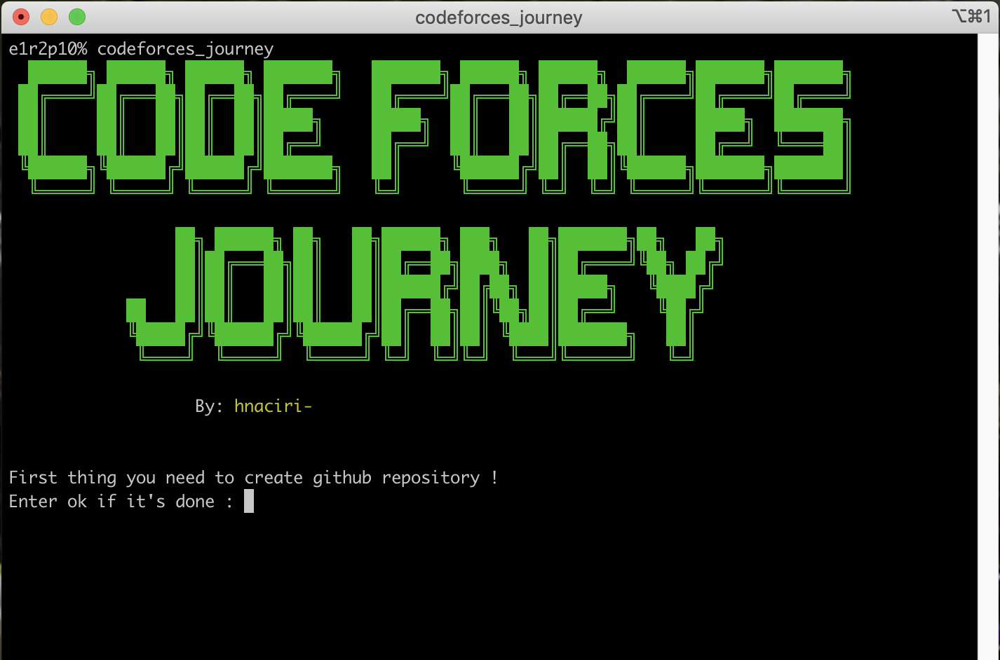
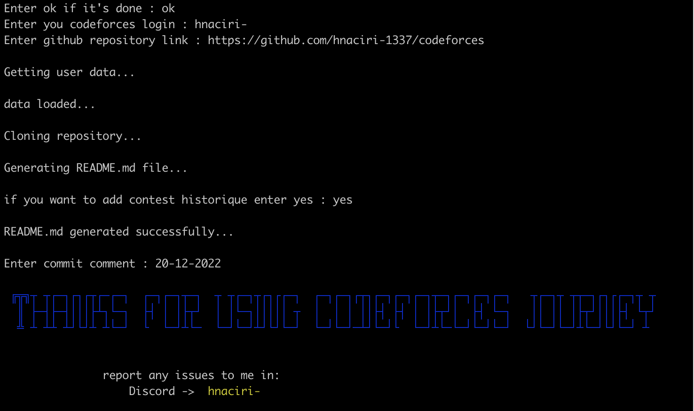

# codeforces_journey


#### + The tool that make it easy !


###### First thing you need to clone this repository !

```bash
git clone https://github.com/hnaciri-1337/codeforces_journey
```

```bash
cd codeforces_journey
```

###### Then just lunch the installation script

```bash
bash installer.sh
```

###### Now just restart the terminal and you can use your new command

```bash
codeforces_journey
```






###### If you need to uninstall the tool just run

```bash
bash uninstaller.sh
```
